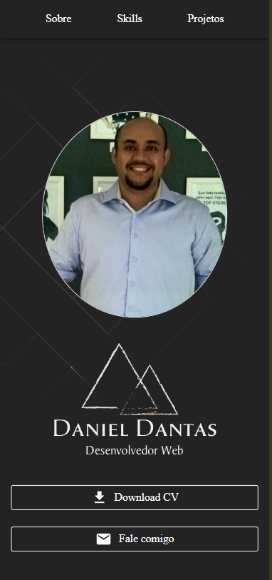
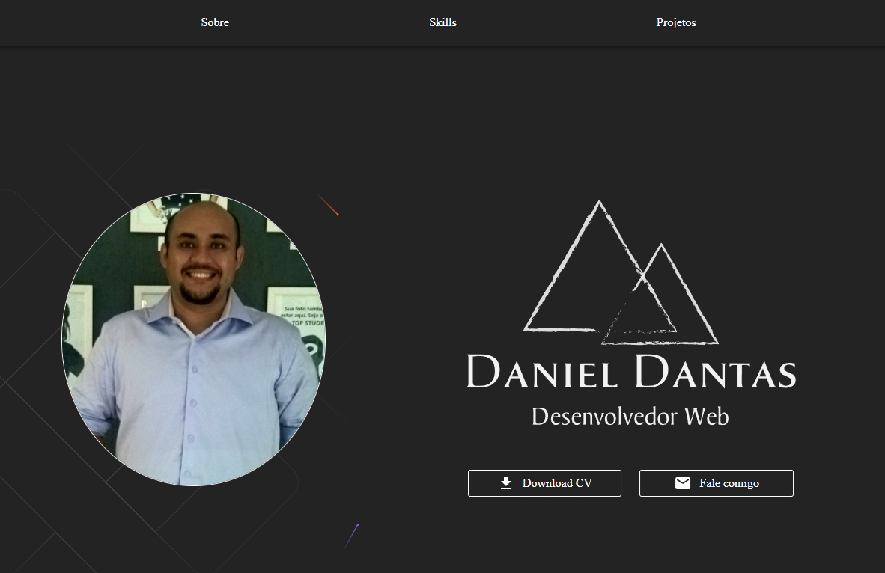

# My Portfolio

My Portfolio é uma aplicação web que exibe informações profissionais, habilidades e projetos do desenvolvedor.

- **Veja Online:** https://gitprofilesearch.vercel.app




## Funcionalidades

- 🏠 Página inicial com informações pessoais e profissionais
- 📄 Seção "Sobre" detalhando experiência e formação
- 🛠️ Seção "Skills" apresentando habilidades técnicas
- 💼 Seção "Projetos" mostrando trabalhos realizados
- 📱 Design responsivo para diferentes dispositivos

## Tecnologias Utilizadas

- React
- TypeScript
- Material-UI
- Styled Components

## Como Executar o Projeto

1. Clone o repositório:

    ```bash
    git clone https://github.com/seu-usuario/my-portfolio.git
    cd my-portfolio
    ```

1. Instale as dependências:

    ```bash
    npm install
    ```

1. Execute o projeto:

    ```bash
    npm start
    ```

1. Abra http://localhost:3000 no seu navegador para ver a aplicação em execução.

## Aprendizados

Este projeto foi uma excelente oportunidade para:

- 🔷 Aprofundar conhecimentos em React e TypeScript
- 🔷 Praticar o uso de componentes estilizados com Material-UI
- 🔷 Implementar design responsivo
- 🔷 Criar uma interface de usuário atraente e profissional

## Contribuições

Contribuições são bem-vindas! Sinta-se à vontade para abrir uma issue ou enviar um pull request.

## Licença

Este projeto está sob a licença MIT. Veja o arquivo LICENSE para mais detalhes.

## Contato

**M Daniel Dantas**

- **LinkedIn:** https://www.linkedin.com/in/mdanieldantas
- **Email:** contatomarcosdgomes@gmail.com
- **Link do Projeto:** [Adicione o link do seu repositório aqui]
